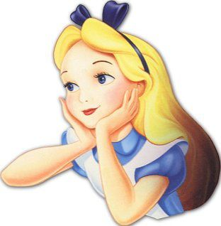

## Introduction 

Movies, they're not just projections on a wall, they're emotional odysseys. Each scene is carefully planned; every line
is ingeniously written. The film industry isn't merely a storyteller, it's a maestro of the grand symphony of creativity
and tradition, innovation and nostalgia.

Perched on the shoulders of the [original publication](http://www.cs.CMU.edu/~ark/personas/), we're taking a deep dive
into cinematic personas. With a more nuanced lens, we're out to uncover if actors wear their characters like well-fitted
gloves, repeatedly slipping into familiar roles, or if they're chameleons, constantly changing hues.

Our quest starts with the tales within the CMU Movie Summary Corpus — more than 42,000 narratives waiting to spill their
secrets. We're exploring deeper, armed with IMDb's vast archives and WikiData' rich knowledge base, to bring new 
dimensions to the personas we explore.

We're on a mission to spot actors that created comfort zones for themselves, our magnifying glass being our data analysis
knowledge. Throughout this analysis, we will be zooming in on patterns, crunching numbers, and charting plots to uncover
comfort zones in movie genres and in personas. We'll also take a peek behind the casting curtain to try and find hidden
patterns in who gets to play the hero, the villain or the casanova.

Join us on this exclusive backstage pass as we lift the velvet curtains on this data. Together, we'll navigate through
this lattice of information to perhaps capture the essence of cinema typecasting.

## So many actors.. is the movie industry really that big ?
Yes.. yes it is! The movie industry is very lucrative. To get a more intuitive feel about the amount of the money involved,
let's compare the movies' revenue to something tangible such as a country's GDP for instance.

  <iframe class="responsive-iframe" src="assets/plot/box_office_vs_gdp.html"></iframe>

The annual box office of the entire film industry is roughly equivalent to Iceland's GDP! Keep in mind that this plot
only takes into account the *box-office* revenue of the film industry. Other sources of revenues such as streaming platform
or DVDs are not even counted in this plot. No wonder actors become so popular. Let's dive in, can actors make or break a movie?

## But first, the CMU Movie.. what ?
The CMU Movie Summary Corpus is a rich corpus which contains multiple datasets related to movies, the characters in it, 
corresponding actors and many other miscellaneous features spanning on more than a hundred year of productions from the
movie industry. The [original publication](http://www.cs.CMU.edu/~ark/personas/) mentioned above used movie summaries
with Latent Dirichlet Allocation to skillfully extract 50 personas and the distribution of personas for each character.
This distribution is what we will use in our analysis further down.

### A dive into personas
But what are personas exactly ? Personas, also called character tropes are those tried and true clichés that we can spot
a mile away. Whether it's the "over-the-top villain" with a maniacal laugh or the "quirky best friend" who's always got
the one-liners, these are the bread and butter of movie land and we just can't get enough of them. So personas are role
or character archetypes. To get a more intuivtive feel of what they are exactly, we've run the original publication
processing pipeline to extract the latent topics of different personas. These latent topics are linked to a list of the
most frequent words that occur in them. Then, using Word2Vec and a dimensionality reduction algorithm (t-SNE) allows us to
reduce those high dimensional vectors to 2 dimensions and visualize them. Here are a couple of character tropes visualized:

  

    <iframe class="responsive-iframe" src="assets/plot/persona_scatter_agent.html"></iframe>
  

  

    <iframe class="responsive-iframe" src="assets/plot/persona_scatter_patient.html"></iframe>
  

  

    <iframe class="responsive-iframe" src="assets/plot/persona_scatter_modifiee.html"></iframe>
  

Personas share many words with each other! They share similar topics but what matters is the combination of them! For instance, look at Persona 14 and 34, both have modifiee "dead". However, Persona 14 "grows", "develops", "invites" and is "reunited", "separated" while Persona 34 "strangles", "impales", "forces" and also gets "impaled", "strangled" in return! For both of those personas, "dead" evoke something different: a tragic love story for Persona 14 and a horror plot for Persona 34... 

### Don't worry, we didn't forget about your favourite action movie star

We also focus on genre-based comfort zones, that is, actors that show recurrent patterns in the genres of the movies
they play in. We can visualize the genre distribution of movies in the pie chart below.

  <iframe class="responsive-iframe" src="assets/plot/genre_pie.html"></iframe>

Something interesting emerging here is that movie genres are not very polarized. We do not have a couple of overwhelmingly
big fractions of one type of movies and breadcrumbs around them.

## Unraveling the threads of cinematic success

Meet our new friend Bob! Bob is a newcomer in the movie acting world. He has always been a fan of sci-fi movies like
Star Wars! His favourite character is Darth Vader because he really enjoys playing the bad guy. However, Bob is not a
fool, he knows that the industry is ruthless. One mistake and your career is over! He is really worried that he can not
play the same character over and over again as he will become too predictable. On the other hand, he also fears falling
into the other extreme, i.e. playing several types of role without forging a clear identity. What should he do? Well,
let's help him with some data analysis!

**The spectrum of ratings**

Bob really wants to maximise the income from the films he plays in. Unfortunately, only a handful of films are able to
make it to the box office. Indeed, in the movie dataset almost 90% of movies do not have a box-office revenue!
Bob is still a newcomer to this industry and can not play in those big blockbusters yet. Nonetheless, he remembers why
he wanted to become an actor in the first place. Even though money is important, Bob's priority was to move people's hearts! 

Therefore, let's have a look at the movies' ratings. In our analysis, we choose the IMDb database. As we'll see, it's less
about the extremes and more like a cozy middle part of the road party. 

  <iframe class="responsive-iframe" src="assets/plot/ratings_histogram.html"></iframe>

  <iframe class="responsive-iframe" src="assets/plot/movie_votes.html"></iframe>

We can notice from the distribution of movie ratings that fewer movies receiving very low or very high ratings, with a
slight tendency of voters to rate movies positively. The "number of movies over number of votes" plot tells us that only
a small number of movies receive a large number of votes.

What has influence over this popularity? Is it memorable characters, or the star power of actors? Should Bob play the same
type of character over and over again to create a sense of comfort in the public, or does he need to keep reinventing himself
to surprise the audience? To uncover the best strategy for Bob, he needs to know what sort of roles he needs to play.
Can he stick to play those menacing villains like Darth Vader during his whole career?

Let's see how many characters actors usually play.

  <iframe class="responsive-iframe" src="assets/plot/actor_roles.html"></iframe>

Only a few famous actors have plethora of multiple roles. Only 16% of actors have more than 5 roles. It turns out
the movie industry's got a "type," and not many actors fit into it. The big names might be playing it safe in their
cinematic comfort zone.

### Character tropes: success or visibility ?

This bifurcation raises intriguing questions: Do more tropes equate to greater success, or simply greater visibility?
Is the industry inclined to favor a selected group and to typecast actors, or do these actors possess an adaptive
chameleon-like quality that lands them role after role, or simply actors tend to have a preference to play some roles
more than others ? We defined metrics that help us understand to what extent actors prefer certain types of characters,
or personas, in their careers.

Conceptually, let's imagine that Alice takes a random role in our dataset and among the different personas that make up
this role, she chooses one persona randomly with probabilities proportional to the proportion of the persona for this
role (i.e if a role is 50% "bad guy" and 50% "big muscled guy", then Alice has 50% of chance to choose the "bad guy"
persona and likewise for the "big muscled guy"). Our best shot to guess which persona she took would be to take the most
represented persona:

  

     
  

  

    <iframe class="fixed-iframe" src="assets/plot/persona_global.html" ></iframe>  
  

In our case, this would be the persona 50.

**Most important words for persona 50:**

| agent   | patient   | modifiee   |
|:--------|:----------|:-----------|
| put     | reject    | close      |
| read    | apologize | elder      |
| drive   | know      | orphan     |
| stay    | spend     | mom        |
| feel    | come      | other      |
| arrive  | lose      | lover      |
| meet    | stop      | dead       |
| accept  | help      | former     |
| believe | wait      | angry      |
| think   | confront  | new        |

We get the impression that we're dealing with a character with no personality, a generic character who is only there to
fill the void on the screen. But now, let's suppose that we know that Christopher Lee (the one who played Count Dooku,
one of Bob's favourite characters) is the one who played this role!

  

     
  

  

    <iframe class="fixed-iframe" src="assets/plot/christopher_lee_persona.html" ></iframe>  
  

Now our answer would be different because **we gained information about the mystery persona**. Indeed, Christopher Lee
tends to always play the same persona: the bad guy! He is Count Dooku, Saruman, Dracula, ... If we look at the most
represented personas for Christopher Lee, we see that Persona 36 and 34 are much more represented than the other ones.
Here are the top words for both personas:

<table>
<tr>
<th> Persona 36 </th>
<th> Persona 34 </th>
</tr>
<tr>
<td>

<table>
<thead>
<tr>
<th style="text-align:left">agent</th>
<th style="text-align:left">patient</th>
<th style="text-align:left">modifiee</th>
</tr>
</thead>
<tbody>
<tr>
<td style="text-align:left">work</td>
<td style="text-align:left">go</td>
<td style="text-align:left">lover</td>
</tr>
<tr>
<td style="text-align:left">fail</td>
<td style="text-align:left">turn</td>
<td style="text-align:left">dead</td>
</tr>
<tr>
<td style="text-align:left">live</td>
<td style="text-align:left">put</td>
<td style="text-align:left">former</td>
</tr>
<tr>
<td style="text-align:left">end</td>
<td style="text-align:left">throw</td>
<td style="text-align:left">angry</td>
</tr>
<tr>
<td style="text-align:left">set</td>
<td style="text-align:left">reveal</td>
<td style="text-align:left">new</td>
</tr>
<tr>
<td style="text-align:left">get</td>
<td style="text-align:left">fight</td>
<td style="text-align:left">worker</td>
</tr>
<tr>
<td style="text-align:left">reach</td>
<td style="text-align:left">knock</td>
<td style="text-align:left">terrorist</td>
</tr>
<tr>
<td style="text-align:left">come</td>
<td style="text-align:left">leave</td>
<td style="text-align:left">able</td>
</tr>
<tr>
<td style="text-align:left">enter</td>
<td style="text-align:left">inform</td>
<td style="text-align:left">black</td>
</tr>
<tr>
<td style="text-align:left">try</td>
<td style="text-align:left">work</td>
<td style="text-align:left">partner</td>
</tr>
</tbody>
</table>

</td>
<td>

<table>
<thead>
<tr>
<th style="text-align:left">agent</th>
<th style="text-align:left">patient</th>
<th style="text-align:left">modifiee</th>
</tr>
</thead>
<tbody>
<tr>
<td style="text-align:left">flee</td>
<td style="text-align:left">work</td>
<td style="text-align:left">worker</td>
</tr>
<tr>
<td style="text-align:left">plan</td>
<td style="text-align:left">run</td>
<td style="text-align:left">terrorist</td>
</tr>
<tr>
<td style="text-align:left">reveal</td>
<td style="text-align:left">fall</td>
<td style="text-align:left">able</td>
</tr>
<tr>
<td style="text-align:left">get</td>
<td style="text-align:left">know</td>
<td style="text-align:left">black</td>
</tr>
<tr>
<td style="text-align:left">hide</td>
<td style="text-align:left">live</td>
<td style="text-align:left">partner</td>
</tr>
<tr>
<td style="text-align:left">impale</td>
<td style="text-align:left">impale</td>
<td style="text-align:left">lover</td>
</tr>
<tr>
<td style="text-align:left">force</td>
<td style="text-align:left">force</td>
<td style="text-align:left">dead</td>
</tr>
<tr>
<td style="text-align:left">strangle</td>
<td style="text-align:left">strangle</td>
<td style="text-align:left">former</td>
</tr>
<tr>
<td style="text-align:left">throw</td>
<td style="text-align:left">throw</td>
<td style="text-align:left">angry</td>
</tr>
<tr>
<td style="text-align:left">appear</td>
<td style="text-align:left">appear</td>
<td style="text-align:left">new</td>
</tr>
</tbody>
</table>

</td>
</tr>
</table>

Persona 36 seems to be a generic persona without too much obvious structure, though "fight" and "knock" can indicate a violent
role. Persona 34 is much more interesting. Words like "plan", "reveal", "impale", "force" and "strangle" suggest that
this persona captures some sort of manipulative villain which is very fitting for an actor like Christopher Lee!

In this case, we gained a lot of information about the "mystery persona" **because Christopher Lee's roles revolve around
a couple of tropes**. In the other extreme, if an actor tends to play personas that are very uniform,
then we would actually lose information about this "mystery persona".

### Mutual Information Preference score of personas: 

With this key idea of information gain we design our first key metric: the **mutual information preference metric, MIP**. 
The MIP score for each trope distribution reveals how closely an actor's choices align with, or diverge from, the
collective narrative palette. An actor whose range of personas closely matches the global distribution would have an MIP
score approaching zero, suggesting a versatile adaptability to the myriad roles the industry offers. In contrast, actors
with higher MIP scores tend to have a more specialized or distinctive selection of character tropes, indicating a niche
or a strong association with particular kinds of roles.
In other words, MIP can tell us whether an actor's repertoire is not particularly special or stands out from the crowd.

For each actor we have computed an "average persona", which is taken over all characters they played. We compute the MIP
of this average persona and report the density of actors over MIP scores below.

  <iframe class="responsive-iframe" src="assets/plot/mip_personas.html"></iframe>

How interesting! As we can observe, the average persona's MIP score of actors tends to be around 0.4, meaning a relatively average polarisation of roles.
The histogram is bell-shaped with a substantial spread. This distribution indicates that while there's a strong central
tendency — most actors have an average degree of persona specialization. The very high spike in density at 1 is due to
actors for which the average persona was fully polarized, that is they only played a single persona accross their movies.
These are likely actors who have only played relatively few movies, or found a niche for which they are frequently typecast.
The thinner left side, shows fewer actors who are characterized by a wide variety of roles, the industry's versatile figures 
and chameleons, leaping from role to role.

The plot highlights the extremes: We have a lot more actors with high MIP scores, often stepping into an electic array
or roles and tend to be more predictable in their role choices. The right spike presents us the specialists that have found 
their niche. We naturally ask: Do these specialization trends observed in persona choices also mirror the genres that actors are drawn to?

### Mutual Information Preference score of genres

We apply roughly the same process on movie genres. For each actor, we recover all the movies they played in and the
genre distribution of those movies. Using this information and the global genre distribution we compute a second MIP
score for each actor. Note that we don't need to use averages here, because this genre distribution is not affected by
a particular movie, in contrast to personas which differ for each character within a given movie.

  <iframe class="responsive-iframe" src="assets/plot/mip_genre.html"></iframe>

The MIP metric, when applied to genres, tells a story about an actor's alignment with the industry's genre landscape.
The distribution is much more concentrated around 0.25 and has minimal spread. This distribution of actors across genres
raises questions about the forces that shape an actor's career trajectory. Is it personal inclination, the allure of
certain types of stories that resonates with their own artistic voice? Or does it reflect the typecasting tendencies of
an industry that finds a formula and sticks to it, sometimes to the detriment of creative diversity?

### The love calculator between an actor and a role

Although Bob really likes to play the villain (like his idol Christopher Lee), he knows that he can not play this persona
for his entire career. Even Christopher Lee, the embodiment of villains, played a good guy like Sherlock Holmes! In general,
even if they have a preference towards some personas, actors sometimes act out of their comfort zone.
Are they more successful when they play out of their comfort zone? To determine if an actor is out of his comfort zone
**for a given role**, the MIP metric is not enough.

Let's use Christopher Lee as our example once again but this time we will look at the genres that he plays. 

  

     
  

  

    <iframe class="fixed-iframe" src="assets/plot/christopher_lee_genres.html" ></iframe>  
  

Here we only plot the genres with more than 1% frequency in his filmography. He seems to have a clear tendency to play
in Horror and Thriller like movies such as _Dracula_. (labeled as **Horror** and **Thriller** movies in our dataset)
Since both of the most represented genres are included in _Dracula_, we can assume that Christopher Lee has some degree
of comfort in playing in this movie.

On the other hand, one of his other movies _the Mummy_ has genres **Horror**, **Archeology** and **Monster movie**.
**Archeology** and **Monster movie** don't even represent 1% of Christopher Lee's played genres. He clearly stepped
out of his comfort zone for this role! The reasoning is that the distribution of genres for this movie is very *far*
from the global distribution of Lee's genres. To quantify this notion of distance, we use the relative entropy, also
known as Kullback–Leibler divergence.

  <iframe class="responsive-iframe" src="assets/plot/genres_kld_histogram.html"></iframe>

  <iframe class="responsive-iframe" src="assets/plot/personas_kld_histogram.html"></iframe>

We use the same idea to compute the Kullback-Leibler divergence for the personas. The plot for personas shows a very
noisy Gaussian with a spike at 0. This may be explained by the fact that a lot of actors tend to only have a few roles
for which they were typecast into the same persona.

### So? What should Bob do?

  <iframe class="responsive-iframe" src="assets/img/two_hrs_later.jpg"></iframe>

Ah yes! Bob! We totally didn't forget him after those very long explanations. Let's try to help him out and provide some
answers.

### The relationship between personas, genres, and movie performance

To investigate whether there is a notable difference in the performance of movies when a certain actor steps out of his
usual roles, we embark on a statistical journey, exploring how the specialization of actors in their roles
and their propensity to engage in familiar roles impact a movie's reception, as measured by its average rating.
To this end we try to predict how well a movie's going to perform using the MIP score of the persona that the actor plays,
and the Kullback-Leibler divergence of that particular persona, which encapsulates how far this actor went out of his
comfort zone.

  <iframe class="responsive-iframe" src="assets/img/KL_heatmap.png"></iframe>

This attempt at predicting movie performance was done through ordinary least squares regression, a mouthful often times
referred to as OLS. The results show that indeed, a higher MIP value for personas, indicative of more specialized actors,
appears to positively impact movie performance. Conversely, engaging in familiar roles correlates positively with a
movie's success.  
Great! Let's go then, I already have a gift idea for Bob. Also, shush! Don't tell him it's a lightsaber, he might get too excited
and pass out..  
Well, not so fast, the coefficients that determine this relationship are *low*, and only explain about 1% of the variance
in a movie's success. Bummer.  

Maybe we'll be more lucky by switching gear to genres ? Actually, not *exactly*.. As in any good story, there's a plot
twist. Intuitively, we sensed that actors excelling in a familiar type of movies would enhance a movie's
performance, as this actor is used to this genre and knows the various quirks that make it work. But, the regression revealed
a negative correlation where comfort and specialization dragged down movie ratings! Fortunately, those coefficients only
explain about 1% of the variance in a movie's success, so they don't impact it too much.

Clearly, the polarization of personas and genres have an effect on a movie's performance, as the p-values of the found
coefficients are all very near 0. However, they are not the main influences *at all*. There's likely another key factor
that might be an unseen confounder variable, such as movie quality, the budget in marketing expenses, etc.
This search of understanding never truly ends.

### OLS Fares [Luca stopped polish above]

We started by organizing movie characters into groups based on their characteristics, creating clusters of characters with similar personalities. Our goal was to see if physical features of actors, like gender, have any effect on how successful their movies are, judged by average movie ratings.

For each character group, we separately studied the impact of these actor features. This approach helps us see if the influence of these features changes depending on the type of characters in the movies.

To decide the best number of character groups, we used a technique called the elbow method. Then, we employed a statistical method known as Ordinary Least Squares (OLS) to investigate how gender, as a characteristic of actors, relates to movie ratings. Here's a summary of what we found from this analysis.

| Cluster | R-squared | Coeff  | p-value  |
|---------|-----------|--------|----------|
| 0       | 0.000     | -0.0266| 0.703    |
| 1       | 0.002     | 0.1572 | 0.115    |
| 2       | 0.002     | 0.0800 | 0.0166   |
| 3       | 0.004     | 0.2133 | 0.00262  |
| 4       | 0.001     | 0.0718 | 0.000018 |
| 5       | 0.000     | 0.0374 | 0.258    |
| 6       | 0.001     | 0.0613 | 0.272    |

The results show that gender doesn't have a consistent or strong impact on how movies are rated across different character groups. Even though we sometimes found notable results, they were not reliable across the board. The low R-squared values from our analysis indicate that gender, as a factor, doesn't play a significant role in determining a movie's average rating. Basically, gender doesn't seem to be a major factor in how well a movie is received by audiences.

<!-- | Cluster | R-squared | Coeff   | p-value |
|---------|-----------|---------|---------|
| 0       | 0.000     | -0.1684 | 0.520   |
| 1       | 0.000     | 0.0655  | 0.843   |
| 2       | 0.001     | 0.0029  | 0.191   |
| 3       | 0.000     | -0.1288 | 0.485   |
| 4       | 0.000     | 0.0426  | 0.607   |
| 5       | 0.001     | -0.3115 | 0.224   |

The analysis using OLS regression shows that the height of an actor has virtually no effect on the average movie ratings. The R-squared value of 0.000 tells us that actor height doesn't account for any variation in movie ratings. Furthermore, the coefficient for actor height is almost zero, indicating that even a considerable increase in height (by one meter) doesn't significantly impact a movie's success.

In essence, across all character clusters, an actor's height doesn't affect how well a movie is received. A taller actor does not necessarily lead to higher movie ratings. Thus, the influence of an actor's height on a movie's average rating is minimal to nonexistent. -->

To sum up, our findings suggest that neither the gender doesn't significantly affect the average ratings of movies. This characteristic of actors doesn't appear to play a crucial role in the success of a movie.

### Ethnicity

Bob was concerned about whether his ethnic background could influence the types of roles he's offered in movies and might limit him to certain roles he didn't want to play. 
To address his concerns, we conducted an analysis to determine if an actor's ethnic origins have an effect on the variety of characters and identities they are typically cast as.
We started by cleaning our dataset to exclude actors without listed ethnicities. Then, we grouped actors together, calculating the average of the character tropes they played. We generated a new dataframe for each persona , which showed the ethnic backgrounds of actors and their related persona trope. 

Our OLS analysis yielded intriguing insights into the relationship between ethnicities and personas. For instance, Persona 35 showed no clear dependence on ethnicity. (could not describe the persona in any way ...) 

Conversely, the 'Elder Believing, Revealing, Uniting' persona demonstrated a notable association with certain ethnicities, as detailed in the following table.

| Ethnicity        | Coefficient | p-value |
|------------------|-------------|---------|
| Hindu            | 0.4510      | 0.000   |
| Dogra            | 0.6210      | 0.000   |
| Mangaloreans     | 0.3921      | 0.001   |
| Hindkowans       | 0.3548      | 0.002   |
| Finns            | 0.3644      | 0.000   |

In contrast, the 'Aggressive Villain' persona, often linked with themes of terrorism, murder, stabbing, hitting, and killing, showed a stronger connection to specific ethnic groups, as indicated in the accompanying table.

| Ethnicity          | Coefficient | p-value |
|--------------------|-------------|---------|
| Tamil American     | 0.7882      | <0.001  |
| Belgians           | 0.7782      | <0.001  |
| Moroccans          | 0.5482      | <0.001  |
| Sephardi Jews      | 0.4249      | <0.001  |
| Afro-Asian         | 0.3932      | <0.001  |
| Portuguese people  | 0.3882      | <0.001  |

Furthermore, personas linked with elements of magic, ghosts, evil, and summoning also displayed a higher association with particular ethnic backgrounds.

| Ethnicity           | Coefficient | p-value |
|---------------------|-------------|---------|
| Albanian American   | 0.1924      | <0.001  |
| Irish Canadian      | 0.1214      | 0.000   |
| Hong Kong people    | 0.0271      | 0.024   |
| Dominican American  | 0.0639      | 0.022   |

## Conclusion:

The movie industry is getting bigger every day. More and more actors work in the field, with each of them playing different
but recurring roles. We were on a mission to discover the various comfort zones that actors created themselves over the years.
What we can for sure is that they exist, both in terms of genre and personas. We meticulously computed each actor's distribution
across movie genres and personas to apply home-brew metrics that show what proportion of actors are/aren't polarized.  
Then we used the KL-divergence to assess whether polarization of actors impacted the performance of movies. We've shown
that there is a correlation, but it is small, and clearly not the root cause behind a movie's success.
Finally, since Bob was curious about how his background might shape his roles. We performed extra regressions looking for
patterns between actor features and movie performance and show that ethnicity does not seem to impact a movie's performance.
The last question we've explored was the impact of ethnicity on actor persona, to again uncover hidden biases in castings.
We provide some rankings which show what group is the most typecast for a given role.

In conclusion, this analysis has been insightful to uncover some trends and recurrent behaviors in the acting world. It
is important to mention some limitations we faced. First and foremost, the personas generated in the original publication are
somewhat hard to really interpret correctly. Most of our conclusions are subject to this observation and lessen the interpretability
of our results.

  <iframe class="responsive-iframe" src="assets/img/personas_meme.jpg"></iframe>

Also, when uncovering link between actor features and typecasting/movie-revenue, we would have liked to
take into account more potential confounders. We definitely tried to bite off more than we could chew.

Notwithstanding, may the roles of aspiring actors out there, especially our friend Bob, be as rich and varied as the movies we love!

## References
[1] Learning Latent Personas of Film Characters  
David Bamman, Brendan O'Connor, and Noah A. Smith  
ACL 2013, Sofia, Bulgaria, August 2013 
