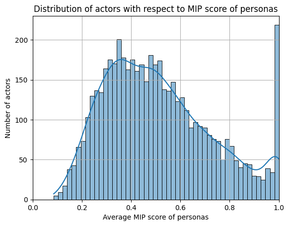

## Introduction 

Movies, they're not just projections on a wall, they're emotional odysseys. Each scene, a heartbeat; every line, a thrill. The film industry isn't merely a storyteller, it's a maestro of the grand symphony of creativity and tradition, innovation and nostalgia.

Perched on the shoulders of the [original paper](http://www.cs.CMU.edu/~ark/personas/) paper, we're taking a deep dive into the cinematic psyche. With a more nuanced lens, we're out to uncover if actors wear their characters like well-fitted gloves, repeatedly slipping into familiar roles, or if they're chameleons, constantly changing hues. (refine at the end to say what we did exactly)

Our quest unravels the tales within the CMU Movie Summary Corpus—more than 42,000 narratives waiting to spill their secrets. We're mining deeper, armed with IMDb's vast archives and TvTropes' rich insights, to bring new dimensions to the personas we explore.

We're on a mission to spot these comfort zones. It's a bit like movie detective work. Do actors reinvent themselves, or do they find a niche and nestle in? We're zooming in on patterns, crunching numbers, and charting the emotional pulse of plots, all while peeking behind the casting curtain. Are there hidden patterns in who gets to play the hero, the villain, the heartbreaker? 

Join us on this exclusive backstage pass as we lift the velvet curtains on the data. Together, we'll navigate through this lattice of information to perhaps capture the essence of cinema—a blend of the uncharted and the classic, the heartbeat of the screen.

<!---

*Old introduction:*

*In the movie industry, creativity is generally considered to be a key factor in the success of a film. Actors often need to reinvent themselves to keep audiences hooked, but do they really ? Some actors tend to develop a comfort zone and keep playing the same type of movies/characters. Our projects aims at discovering those comfort zones, when they are created and what happens when actors step out of it. Conversly, we also want to evaluate if a given role/character tends to be played only by a subset of actors and which feature(s) these actors share, which could lead us to uncover racial or gender biases in film castings. We build on top of the results of the [original paper](http://www.cs.CMU.edu/~ark/personas/) in order to identify in a more fine-grained approach if an actors exhibit a recurring persona accross the characters they play.*

### Tiny description of what was done on the original paper ?
-->

## Unraveling the threads of cinematic success

Is a movie's success etched in box office gold and revenue, or does it reside in the hearts of viewers and the pens of critics? While blockbusters rake in the cash, they represent just a sliver of the film universe.

<!--  -->

  <iframe class="responsive-iframe" src="assets/plot/box_office_vs_gdp.html"></iframe>

By way of comparison, the annual box office of the entire film industry is equivalent to Iceland's GDP! But why are they so popular? What makes a good movie? Let's delve into what truly marks a film's success!

**The Spectrum of Ratings: A Glimpse into Popularity**
Dive into the world of ratings, you'll see it's less about the extremes and more like a cozy middle part of the road party. 

  <iframe class="responsive-iframe" src="assets/plot/ratings_histogram.html"></iframe>

  <iframe class="responsive-iframe" src="assets/plot/movie_votes.html"></iframe>

<!--

  

    <iframe class="responsive-iframe" src="assets/plot/ratings_histogram.html"></iframe>
  

  

    <iframe class="responsive-iframe" src="assets/plot/movie_votes.html"></iframe>
  

-->

We can notice that from the distribution of movie ratings that fewer movies receiving very low or very high ratings, with a slight tendency of voters to rate movies positively. The "number of movies over number of votes" plot tells us that only a small number of movies receive a large number of movies.  The "more votes, more hype" graph shows that if a movie gets more eyeballs, it's likely to get more love or hate in the ratings.

What has influence over this popularity? Is it a riveting storyline, memorable characters, or the star power of actors? Our love for cinema often ties to the allure of familiar faces. Yet, our analysis uncovers a pattern — a stage where actors don familiar masks more often than not.

## Star Power: Are Actors the Puppet Masters of Popularity?

As big movie fans, we love some movies because one of our favourite actors play in them.
However, some actors stick to playing the same characters. We got really intrigued by this phenomena. Let's study each actor and the characters they play.

...

## Tropes : Figurative or metaphorical personas
Tropes are those tried and true clichés that we can spot a mile away. Whether it's the "over-the-top villain" with a maniacal laugh or the "quirky best friend" who's always got the one-liners, these are the bread and butter of movie land and we just can't get enough of them.

## Stereotypes on Screen: The Tropes We Love to Recognize
To find the most recurrent tropes in the movie industry, we use a Latent Dirichlet Allocation method described [here](https://aclanthology.org/P13-1035.pdf). This algorithm creates 50 personas and associates each of them with a list of words that appear frequently with those personas. Let's try look at those personas a little bit more closely! To visualize the meaning of different personas, we will use the [word2vec](https://arxiv.org/abs/1301.3781) representations of the most frequent words in a couple of generated tropes. Then, we use TSNE to reduce those high dimensional vectors to 2 dimensions in order to visualize them. Here are our results for a couple of tropes:

  <iframe class="responsive-iframe" src="assets/plot/persona_scatter.html"></iframe>

We definitely find our beloved villain with persona 43! Words like "vampire", "witch" and "pirate" are associated to this persona. Switching gears, certain personas have a peculiar penchant for verbs rather than the usual character attributes, just like our friend Persona 14. Take a moment to appreciate the action-packed spectacle, where verbs like "stab," "threaten," "kill," and "kidnap" take center stage. Believe me, crossing paths with Persona 14 is like willingly stepping into a party where enemies are the uninvited guests...

This leaves us to wonder what is the proportion of actors that tend to play the same type of movies? Let's find out!

  <iframe class="responsive-iframe" src="assets/plot/actor_roles.html"></iframe>

We find out that there are only a few famous actors with multiple roles. Only 16% of actors had more than 5 roles.  
It turns out Hollywood's got a "type," and many actors fit right into it. The big names might be playing it safe in their cinematic comfort zone. 

 This bifurcation raises intriguing questions: Do more roles equate to greater success, or simply greater visibility? Is the industry inclined to favor a select group and to typecast actors, or do these actors possess an adaptive chameleon-like quality that lands them role after role, or simply actors tend to have a preference to play some roles more than others.. We defined metrics that help us understand to what extent actors prefer certain types of characters, or personas, in their careers.
One key metric is the cross entropy metric, which essentially measures the predictability of an actor's persona based on their previous roles. It gives us a numerical value representing how often an actor is seen in a particular type of role. Think of it as a way to quantify an actor's range or lack whether they are frequently cast as the villain, the hero, the sidekick, and so on.
Another fascinating measure is the **mutual information preference metric, MIP**. At its core, MIP is about information gain—the degree to which knowing about an actor’s previous roles gives us insight into their future roles. 
1. A MIP score of 1 signifies an actor with a singular focus
2. An MIP score of 0 indicates an actor whose choices mirror the global distribution of roles or genres. (Emma Watson)
3. An MIP score below 0 is where things get even more interesting. Here we find actors who are the very embodiment of diversity, their choices more varied than the industry average. (Johnny Depp)

In other words, MIP can tell us whether an actor's repertoire is not particularly special or stands out from the crowd.

### Mutual Information Preference score of personas: 
We have gathered a comprehensive collection of distinct character tropes. Each actor's set of characters is distilled into a unique distribution, representing their personal spectrum of on-screen personas. From the solitary hero to the ingenious antagonist, each trope contributes to this array.

The heart of the analysis lies in the construction of the global distribution of these tropes. By calculating the entropy of this distribution, we obtain a measure of the overall diversity present in character tropes within the acting world. High entropy indicates a vast, unpredictable array of character types, while lower entropy suggests a more uniform or predictable set of character tropes... continue

The MIP score for each trope distribution reveals how closely an actor's choices align with, or diverge from, the collective narrative palette. An actor whose range of personas closely matches the global distribution would have an MIP score approaching zero, suggesting a versatile adaptability to the myriad roles the industry offers. In contrast, actors with higher MIP scores tend to have a more specialized or distinctive selection of character tropes, indicating a niche or a strong association with particular kinds of roles.

The histogram is bell-shaped with a substantial spread but with a skewness towards higher MIP scores. This distribution indicates that while there's a strong central tendency — most actors have an average degree of persona specialization.
The thicker right tail suggests that there are more actors than expected who tend to play similar types of characters consistently, as opposed to having a broader range. These are likely actors who have found a niche or are frequently typecast. The thinner left side, shows fewer actors who are characterized by a wide variety of roles, the industry's versatile figures and chameleons, leaping from role to role.

The plot highlights the extremes: We have a lot more actors with high MIP socres, offten stepping into an electic array or roles and tend to be more predictable in their role choices. The right tail presents us the specialists that have found their niche. We naturally ask: Do these specialization trends observed in persona choices also mirror the genres that actors are drawn to?

### Mutual Information Preference score of genres

Turning our lens to the realm of genres, the visualization before us, a distribution of actors with respect to the Mutual Information Precision (MIP) score of genres—offers a quantified glimpse into this interplay between actors and the genres they navigate.
MIP metric, when applied to genres, tells a story about an actor's alignment with the industry's genre landscape. (add global genre distribution)
The peak around the zero mark suggests a majority of actors whose genre affiliations are in harmony with industry trends. To the **left**, where the MIP scores dip into the negatives, are the actors whose genre choices are less predictable, those who defy easy categorization. 
To the **right**, the graph thins out, representing those few actors whose careers are tightly intertwined with specific genres. These could be the icons of their domains—actors who, when we think of a thriller or a sci-fi epic, come readily to mind.

This distribution of actors across genres raises questions about the forces that shape an actor's career trajectory. Is it personal inclination, the allure of certain types of stories that resonates with their own artistic voice? Or does it reflect the typecasting tendencies of an industry that finds a formula and sticks to it, sometimes to the detriment of creative diversity?

<!-- These are the risk-takers or perhaps those who are not so easily embraced by the mainstream, their filmographies a patchwork of various styles and narratives.
-->

### Plot that michael did

